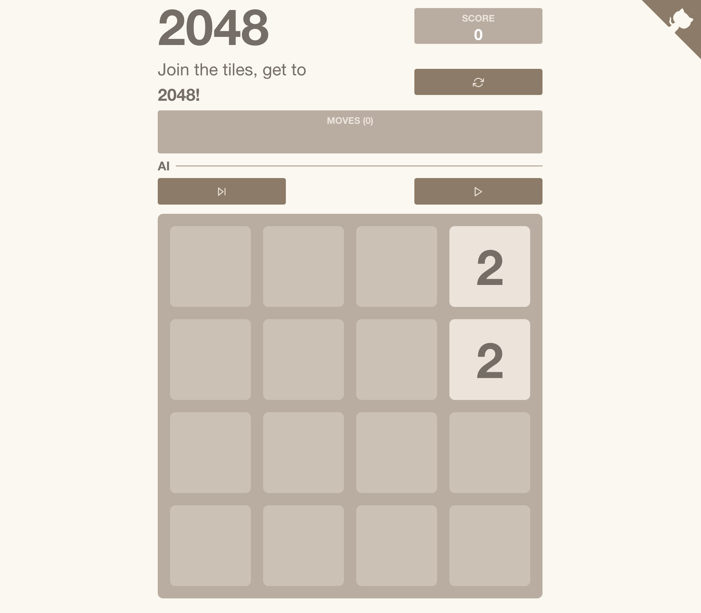

# 2048 - AI



Yet another artificial intelligence applied to a game project of mine. You can [play it here](https://virgs.github.io/2048-ai)
If you haven't done it yet, I highly recommend checking the other ones I have on GitHub:

- [Pacman](https://github.com/virgs/pacman)
- [Sudoku](https://github.com/virgs/sudoku)
- [Minesweeper AI](https://github.com/virgs/minesweeper-ai)
- [Flappy Bird AI](https://github.com/virgs/flappy-bird-ai)
- [Rubik's Cubes AI](https://github.com/virgs/rubiks-cubes-ai)
- [Mancala](https://github.com/virgs/mancala)
- [Tetris](https://github.com/virgs/tetris)

----

This implementation provides you with 2 AI actions:

1. *Make one move*: makes the best move according to the [AI](#pure-mtcs).
2. *Play*: it essentially keeps *making one move* repeatedly. It makes a move, then based on the updated board configuration, makes another move, and so on...

Check out the AI in action on [Youtube](https://www.youtube.com/watch?v=oEMtw2X4LLE)

## Report

Given my latest obsession with gaming artificial intelligence ([flappy-bird](https://virgs.github.io/flappy-bird-ai/?mutationRate=0.01&populationPerGeneration=1500&relativeSelectedPopulationPerGeneration=0.01&qBirdsNumber=100), [mancala](https://virgs.github.io/mancala/), [rubiks-cubes](https://virgs.github.io/rubiks-cubes-ai/?cube=0&methods=&moves=), [minesweeper](https://virgs.github.io/minesweeper-ai)) projects, it was just a matter of time until I find a new AI approach to study. 2048 was the perfect game to apply the [**Pure Monte Carlo Tree Search**](#pure-mtcs).  

With no further ado, I present to you my approach of an **Artificial Intelligence** agent to play  **2048**.

### The game

If you've been abducted by an extraterrestrial civilization for the past 15 years and don't know what 2048 is. Here's a quick recap.

2048 is a game that blends numbers and strategy into a captivating puzzle. In this 4x4 grid, you navigate tiles with powers of two, aiming to combine them strategically and reach the coveted 2048 tile.

The mechanics are simple yet offer a profound challenge. You slide tiles across the board, merging identical ones to create larger numbers. The objective is to continue this process until you reach the elusive 2048 tile, demonstrating your mastery over the numerical cascade.

However, the game introduces an element of unpredictability. With each move, a new tile appears, introducing an element of randomness that demands careful planning and adaptability. Success hinges on your ability to balance strategic thinking with the ever-evolving board.

So, step into the world of 2048, where numbers and logic intertwine in a quietly absorbing puzzle. It's a journey that invites contemplation and rewards thoughtful maneuvering. Will you unravel the mysteries of the grid, or will the numbers prove to be an enigmatic challenge? The answers lie in your strategic choices as you navigate this numerical landscape

### Goals

1. [**To write an artificial intelligence agent that can play any of the 2048 better than I do**](#artificial-intelligence). To be honest, that's not that hard. I suck and don't thik I beat it more than 3 times. But this is a fair goal and it will be nice to see how the AI can master this game. Its win ratio, number of moves, max score...

As I always do, a lot of different side goals came with this project. Among them:

2. [Study react](https://react.dev/)
3. [Study HTML/CSS](#htmlcss)
4. Last but not least: **to have fun**. Yay!

#### Artificial Intelligence

A pure version of the MCTS is used to decide the next direction to move to. In order to do so, **1500** games are randomly played until the game is over having one direction fixed as the next move. The direction that has the better average score in each direction is chosen as "next move".

##### Monte Carlos Tree Search

Monte Carlo tree search (MCTS) is a heuristic search algorithm for some kinds of decision processes, most notably those employed in software that plays board games. In that context MCTS is used to solve the game tree.

- **Selection**: Start at the root of the tree and recursively select nodes until a leaf node is reached. The selection can be random or based on a simple policy.
- **Expansion**: If the selected node hasn't been fully expanded (i.e., there are unexplored moves from that state), expand it by adding a child node corresponding to an unexplored move.
- **Simulation (Rollout)**: Conduct a simulation (also known as a rollout or playout) from the newly added node or the previously existing one. This involves making random moves or using a simple heuristic until a terminal state is reached.
- **Backpropagation**: Update the statistics of all nodes traversed during the selection and expansion steps. This involves incrementing visit counts and adjusting the cumulative value based on the outcome of the simulation.

Repeat these steps for a specified number of iterations or until a time limit is reached. The final move is typically chosen based on the statistics gathered at the root node.

##### Pure MTCS

The [pure version of MCTS](https://en.wikipedia.org/wiki/Monte_Carlo_tree_search#Pure_Monte_Carlo_game_search) doesn't incorporate heuristics like UCB, making it more straightforward but potentially less efficient in balancing exploration and exploitation. It serves as a foundational framework upon which various enhancements can be applied to tailor the algorithm to specific problems.

This basic procedure can be applied to any game whose positions necessarily have a finite number of moves and finite length. Such as 2048. For each position, all feasible moves are determined: k random games are played out to the very end, and the scores are recorded. The move leading to the best score is chosen. Ties are broken by fair coin flips.

Pure Monte Carlo Game Search results in strong play in several games with random elements, as described below in the [outcome section](#outcome). It converges to optimal play (as k tends to infinity) in board filling games with random turn order.

#### React

It's kinda embarrassing, but I confess I need to strengthen my React skills. It's been at least 5 years since the last time I professionally worked with it, and the front-end personal projects I've been working on in this meantime were developed based on Vue.

Needless to say, react has solidified itself as a cornerstone in contemporary web development. Its relevance in the present landscape is unmistakable, providing developers with an efficient tool to manage complex UI logic and seamlessly update the view when the underlying data changes.

#### HTML/CSS

I feel like there is always something new to learn in HTML/CSS. For good reason, not just because it's a rapidly evolving stack, but mostly because I'm not very strong with it. I'm constantly surprised by what people do with them, and most of the time I have no idea how to do even 20% of what they're capable of.

I'm sure there's a long road paved with CSS and HTML blocks ahead, but I'm happy to be making progress.

## Outcome

If you didn't skip the goals section or weren't getting distracted playing a game like, let's say, 2048, you'll remember that the main goal was to have a better ratio win than me. As mentioned earlier, I'm a terrible player, and I don't think I've managed to win this game more than 2 or 3 times in my lifetime.  

### Methodology

To generate the AI win ratio and the other numbers in the table, the AI plays **100** with times every MCTS pre-defined configuration (50, 100, 250, and 1000). I know that, ideally, I'd have to run a few thousand times and 100 times is not enough. But this is the best I can do, given I have more things to do with my life and some of them took long hours to be generated. Check the [files yourself here](./reports/) to feel the pain I'm talking about.

One last thing worth remembering is that whilst these configurations were used to generate the reports, the MTCS used to assist the player is configured to run **1500** randomly played games in each of the four directions before deciding the next move. Therefore, its expected behavior should much surpass the 91% victory ratio.  

### Performance Analysis

| Configuration | Win Ratio | Greatest tile value (max, p5, p50, p95) | Score (max, mean, p5, p50, p95) |
|--- | --- | --- | --- |
| 50 | 58% | (max: 4096, p5: 2048, p50: 2048, p95: 512) | (max: 60264, μ: 24937.2, p5: 36312, p50: 27092, p95: 7032)  |
| 100 | 73% | (max: 4096, p5: 4096, p50: 2048, p95: 512) | (max: 74848, μ: 29711.84, p5: 51376, p50: 32320, p95: 7112) |
| 250 | 83% | (max: 4096, p5: 4096, p50: 2048, p95: 1024)  | (max: 71436, μ: 34911.96, p5: 60624, p50: 34532, p95: 16036)  |
| 1000 | 91% | (max: 4096, p5: 4096, p50: 2048, p95: 1024) | (max: 80572, μ: 45571.84, p5: 76612, p50: 36292, p95: 16020)  |

You can check these values yourself [here](./reports/) and suggest better approaches by coding them yourself.

## Code It Yourself

### Project Setup

```sh
npm install
```

#### Compile and Hot-Reload for Development

```sh
npm run dev
```

#### Type-Check, Compile, and Minify for Production

```sh
npm run build
```

#### Format

```sh
npm run format
```
